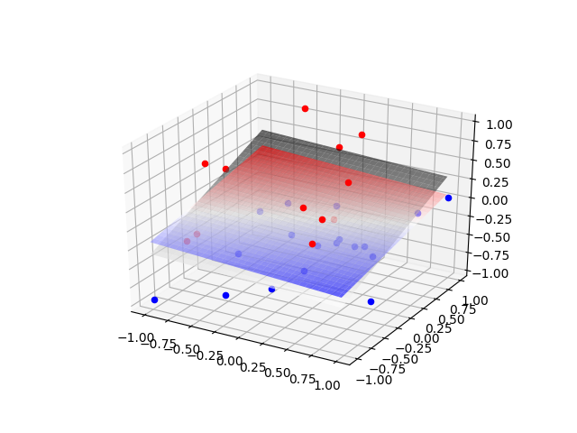
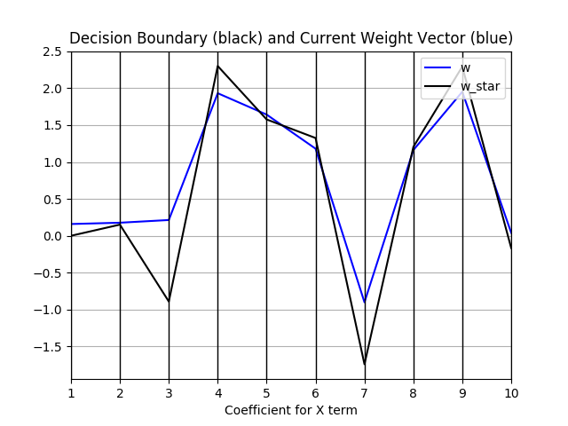

# Perceptron

## Background
This small project is an extension of my first assignment for my machine learning class. We were tasked with implementing and observing the perceptron algorithm. I was left in **awe** watching the classifying line inch closer and closer to the boundary line for the first time, and wanted to explore this a little further.

This repo sort of cleans up my past attempts with two-dimensional data, and generalizes it to n-dimensional with weight visualization and a 3D visualization.

## What is a Perceptron?
The perceptron is an algorithm for linear classification. We feed it a set of input data **D** where every point in **D** contains a vector **x** and a classification **ell**. _Assuming **D** is linearly separable_, we can find a set of weights **w** that define the hyperplane to divide **D**. 

Let's say we have floor of apples and oranges. We place the apples on one side of the room, and the oranges on another. The perceptron allows us to predict if a given point on this floor will rest on an apple or an orange.

## This Repository Holds...
1. Point Class
2. Benchmark Class (more like a namespace)
3. Perceptron Function
4. Visualize Class (more like a namespace)

Every _Point_ instance has two attributes: a coordinate vector __x__ and a label __ell__. The _Point_ class also contains our _theta_ function, which is our linear classifier. 

To generate our training data, the _Benchmark_ class holds one function to randomly generate a list of _Point_ instances, and classify their data using a randomly generated hyperplane. This ensures that our data is always linearly separable. More parameters include the number of points __N__, the margin width __gamma__, the scale of the data __scale__, and the dimension of the data __i__.

Our perceptron function isn't anything special. (: We do have the option to visualize our data every epoch or point.

And last but not least, the  _Visualize_ class. There exists functions to plot 2-dimensional and 3-dimensional data, as well as a coefficient plotter for n>3 dimensional data.

I initially wanted to produce a matrix of plots comparing every pair of dimensions with each other for n>3 data, but quickly realized that this doesn't produce anything meaningful (you can see my past commits for this). Instead, I opted for a parallel coordinate plot that tracks the hyperplane coefficients for our decision boundary and the weights from our perceptron. 

 

## Visualizations

### 2-dimensional Data, Classification Line
**N** = 30, **C** = 0.001, **gamma** = 0.01, **scale** = 1

_The black dotted line represents our decision boundary line. The magenta line represents the current line formed by our weight vector (from perceptron). Note that our perceptron has not yet converged._

_Our perceptron has now converged!_

### 3-dimensional Data, Classification Plane
**N** = 30, **C** = 0.01, **gamma** = 0.01, **scale** = 1

_The black plane represents our decision boundary plane. The magenta line represents the current plane formed by our weight vector (from perceptron). Note that our perceptron has not yet converged._

_Our perceptron has now converged!_

### n-dimensional Data, Classification n-1 Hyperplane
**N** = 1000, **C** = 0.001, **gamma** = 0.001, **scale** = 1

_The black line represents our decision boundary coefficients (solving for highest dimension). The magenta line represents our current boundary coefficients (from perceptron). Note that our perceptron has not yet converged._

_Our perceptron has now converged!_